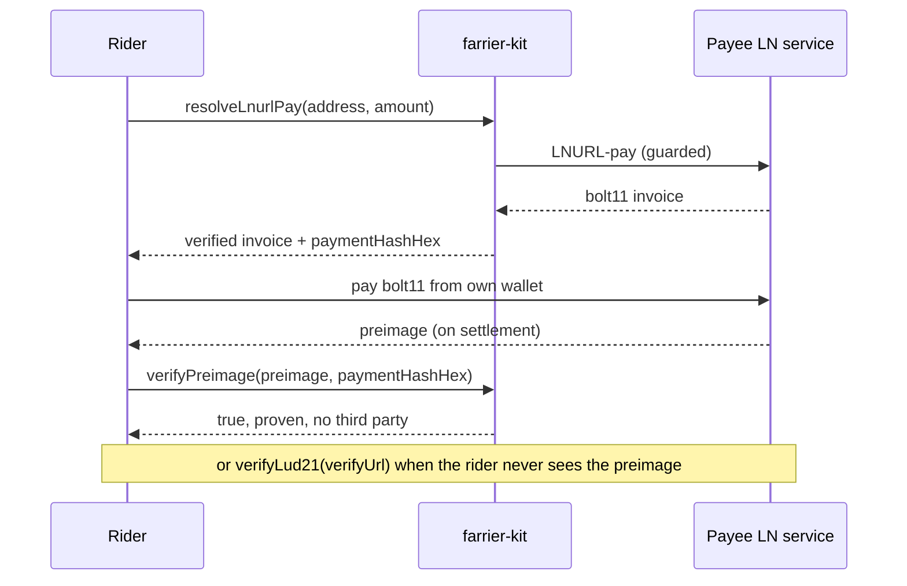

# farrier-kit

[](https://github.com/forgesworn/farrier-kit/actions/workflows/ci.yml)
[](https://primal.net/p/npub1mgvlrnf5hm9yf0n5mf9nqmvarhvxkc6remu5ec3vf8r0txqkuk7su0e7q2)
[](./LICENSE)

Lightning payment primitives that work anywhere. A farrier shoes working animals
for the road. This kit shoes your payment paths.

Reach for farrier-kit when an app needs to read and verify Lightning payment data
without running a node. Decode a BOLT-11 invoice, resolve a Lightning Address to
an invoice for an exact amount, and prove a payment settled. It runs in the
browser and in Node from one codebase, depends only on
[`@noble/hashes`](https://github.com/paulmillr/noble-hashes), and ships
[language-neutral conformance vectors](./CONFORMANCE.md) so a Kotlin or Swift port
can verify payments the same way.

It is not a wallet and not a node client. It holds no keys and moves no money. It
decodes, resolves, and verifies.

## Modules

| Import | What it does |
|--------|--------------|
| [`farrier-kit/bolt11`](#bolt11) | Decode a BOLT-11 invoice: payment hash, amount, description, expiry, network. Checksum-verified, without pulling in a node library to read two fields. |
| [`farrier-kit/preimage`](#preimage) | `payment_hash = SHA-256(preimage)`: generate, hash, verify in constant time. |
| [`farrier-kit/lnurl`](#lnurl) | Lightning Address to invoice (LUD-06/16), LUD-21 verify, capability probing. The fetch is SSRF-guarded and the invoice you get back is checked for amount, network, expiry, and description-hash. |
| [`farrier-kit/http`](#http) | `fetchJson` with a hard timeout, a response-size cap, and a redirect default that does not bounce you inward. |
| [`farrier-kit/node`](#node) | Node-only. A DNS-pinned `fetch` for resolving untrusted LNURL hosts on a server: it resolves once, refuses any private answer, and pins the socket to the approved address so a rebinding race cannot swap in an internal one. |

## Install

```bash
npm install farrier-kit
```

Node 18 or newer. Dual ESM and CJS, with TypeScript types. No configuration and no
build step in the consumer.

## Design rules

These are the constraints the library holds itself to, and CI enforces the first
two.

1. One codebase for the browser and Node. Nothing imports from `node:`. CI greps
   for it and bundles the output with `esbuild --platform=browser` to prove it.
   `@noble/hashes` is the only runtime dependency.
2. Dual ESM and CJS. Use `import` or `require`, with any bundler.
3. `fetch` is a parameter you can pass in, never an ambient assumption.
4. Amounts are explicit. Millisatoshis are `bigint`. `amountSats` is set only when
   the amount divides exactly, and flooring is its own named call
   (`msatsToSatsFloor`), so a sub-satoshi remainder can never disappear on you.
5. Checked against independents. Every invoice fixture is cross-validated against
   `light-bolt11-decoder` and the BOLT-11 spec vector, preimage hashing against a
   second SHA-256, and the whole verifiable surface is pinned by
   [conformance vectors](./CONFORMANCE.md).
6. Safe by default. The LNURL path refuses non-HTTPS, credentials, private IPs,
   redirects, and oversized bodies without being asked.

## How resolution and verification fit together

`resolveLnurlPay` is a pipeline. Every network hop is SSRF-guarded, and the
invoice the payee returns is decoded and checked against what you asked for before
you ever see it.


The settlement lifecycle is non-custodial. The operator advertises and verifies,
and the rider pays the payee directly.



## bolt11

```js
import { decodeBolt11, verifyInvoiceCommitment } from 'farrier-kit/bolt11'

const inv = decodeBolt11('lnbc2500u1p...')
inv.paymentHashHex // '0001…0102'
inv.amountMsats    // 250000000n  (bigint, null when amountless)
inv.amountSats     // 250000      (null when not a whole satoshi)
inv.network        // 'bc' | 'tb' | 'tbs' | 'bcrt' | 'sb'
inv.expirySeconds  // 60 (spec default 3600 when absent)

// Pre-payment check. The payment_hash on its own is not enough: the payee picks
// the preimage, so they can mint a second invoice with the same hash for any
// amount. Pass expectedMsats, and rely on the default mainnet network, when money
// is about to move.
const check = verifyInvoiceCommitment({
  bolt11,
  paymentHash: expectedHash,
  expectedMsats: 250000000n,
})
if (!check.ok) throw new Error(check.reason)
```

`decodeBolt11` throws a `Bolt11Error` with a machine-readable `code` on anything
that is not a checksum-valid invoice carrying a payment hash. When "not an
invoice" is expected input, use `tryDecodeBolt11`, which returns `null`, or the
single-field helpers `bolt11PaymentHash` and `bolt11AmountMsats`.

## preimage

```js
import { generatePreimage, computePaymentHash, verifyPreimage } from 'farrier-kit/preimage'

const preimage = generatePreimage()
const paymentHash = computePaymentHash(preimage)
// ... the invoice settles and the counterparty reveals the preimage ...
verifyPreimage(revealed, paymentHash) // constant-time true or false
```

The signatures line up with [escrow-kit](https://github.com/forgesworn/escrow-kit),
so that library can adopt these by re-export.

## lnurl

```js
import { resolveLnurlPay, verifyLud21 } from 'farrier-kit/lnurl'

// Lightning Address to a bolt11 invoice for an exact amount. The invoice has been
// decoded and checked: the amount equals the request, mainnet by default, not
// expired, and for zaps the description_hash commits to the zap request.
const paid = await resolveLnurlPay({ address: 'alice@wallet.example.com', amountSats: 21000 })
paid.bolt11         // hand to any wallet
paid.paymentHashHex // verify the revealed preimage against this
paid.verifyUrl      // LUD-21, origin-bound to the callback, when offered

// LUD-21 settlement check. verified is true only when a returned preimage
// cryptographically matches. settled on its own is the service's word, not proof.
const status = await verifyLud21({ verifyUrl: paid.verifyUrl, paymentHashHex: paid.paymentHashHex })
```

## http

```js
import { fetchJson } from 'farrier-kit/http'

const body = await fetchJson('https://example.com/.well-known/lnurlp/alice', {
  timeoutMs: 5000,   // default 8000
  maxBytes: 262144,  // default 10 MB, metered and aborted mid-flight
  fetchImpl: myFetch,// optional, defaults to globalThis.fetch
})
```

`fetchJson` sets `redirect` to `'manual'` by default. For a payments util that is
the safe choice, since a public host should not be able to 3xx-bounce a request
inward. Pass `redirect: 'follow'` if you want redirects.

## node

Node-only. `createPinnedFetch` returns a `fetch` you pass as `fetchImpl` to
`resolveLnurlPay`, `verifyLud21` or `createCapabilityProbe`. It is the server-side
answer to DNS rebinding (see the SSRF section for why a URL check alone is not
enough).

```js
import { createPinnedFetch } from 'farrier-kit/node'
import { resolveLnurlPay } from 'farrier-kit/lnurl'

const pinnedFetch = createPinnedFetch() // rejects any private/reserved answer

const invoice = await resolveLnurlPay({
  address: 'alice@example.com',       // untrusted, payee-controlled
  amountSats: 1000,
  fetchImpl: pinnedFetch,             // metadata, callback and verify URLs all pinned
})
```

It resolves the hostname once, rejects the request if any answer is private,
loopback, link-local, reserved, documentation-only or multicast, and connects the
socket to the one approved address by overriding its DNS lookup, so there is no
second resolution to race. The TLS SNI, certificate check and HTTP Host header
stay on the original hostname. It never follows redirects, and it is HTTPS-only:
the pin proves you reached the address you resolved, which means nothing on a
cleartext channel. Pass `allowPrivate: true` and `allowHttp: true` only for local
development against regtest or localhost.

## SSRF: what the guard does and does not do

`resolveLnurlPay` fetches from payee-controlled domains, so it is an SSRF surface.
The built-in guard rejects an HTTPS violation, credentials in the URL,
`localhost`, `.local` and `.internal` hosts (trailing dots included), and any IP
literal in a private or reserved range. That covers IPv4 and every IPv6 form the
URL parser normalises to: mapped `::ffff:*`, NAT64, 6to4, Teredo, link-local,
site-local, ULA, and multicast.

Here is what the core cannot do on its own. It cannot stop a hostname that
resolves to a private address, such as an attacker A-record pointing at
`10.0.0.5`, or a DNS-rebinding race. Browsers cannot resolve DNS at all, so this
pinning is a server-only job; a browser should never resolve an untrusted address.

On a server, use `createPinnedFetch` from [`farrier-kit/node`](#node):

```js
import { createPinnedFetch } from 'farrier-kit/node'
import { resolveLnurlPay } from 'farrier-kit/lnurl'

await resolveLnurlPay({ address, amountSats, fetchImpl: createPinnedFetch() })
```

Why not just a `urlGuard` that resolves DNS and checks the address? Because that
is a check, and the fetch that follows is a separate connection that resolves DNS
again. Between the two lookups the answer can change: public when you check,
private when you connect. That gap is DNS rebinding, and a check-then-fetch cannot
close it. `createPinnedFetch` does, by being the connection: it validates the
address it is about to use and pins the socket to it.

The `urlGuard` hook still exists for an extra synchronous check on every URL (an
allowlist, say). It runs after the built-in checks, but it does not replace
`createPinnedFetch` for rebinding.

## Conformance and porting (Kotlin, Swift, Rust)

The pure, deterministic surface is pinned by language-neutral vectors in
[`vectors/`](./vectors), so a native port can be checked byte-for-byte against the
same contract the TypeScript reference passes. See
[CONFORMANCE.md](./CONFORMANCE.md). This is how the Android and GrapheneOS clients
on the roadmap verify payments the same way as the browser build. The vectors ship
in the npm package, and CI regenerates them from independent oracles and fails on
any drift.

## Security

farrier-kit had a full independent security review before its first release: three
reviewers plus a Codex cross-check. The SSRF guard, the invoice amount and network
gating, and the response caps were hardened as a result, each with a regression
test. Cryptography is [`@noble/hashes`](https://github.com/paulmillr/noble-hashes),
not hand-rolled. It has not had a paid third-party audit, so treat it accordingly
for high-value custody. Report issues via
[GitHub](https://github.com/forgesworn/farrier-kit/issues).

## Comparison

Most Lightning JS libraries either only decode an invoice, or are wallet and
payment toolkits that resolve a Lightning Address and hand you an invoice to pay.
farrier-kit sits in a different spot. It is the read-and-verify layer you run
before payment.

| Library | bolt11 decode | LNURL resolve | invoice gating¹ | SSRF guard | preimage / LUD-21 verify | sends / zaps | browser + Node | core deps |
|---|:--:|:--:|:--:|:--:|:--:|:--:|:--:|---|
| **farrier-kit** | ✓ | ✓ | ✓ all four | ✓ | ✓ | ✗ | ✓ | @noble only |
| [light-bolt11-decoder](https://github.com/fiatjaf/light-bolt11-decoder) | ✓ | ✗ | ✗ | – | ✗ | ✗ | ✓ | `@scure/base` |
| [bolt11](https://github.com/bitcoinjs/bolt11) (bitcoinjs) | ✓ +encode/sign | ✗ | ✗ | – | ✗ | ✗ | ~ native secp | heavy |
| [@getalby/lightning-tools](https://github.com/getAlby/js-lightning-tools) | ✓ | ✓ | ✗ | ✗ | ✓ | ✓ zaps/NWC/L402 | ✓ | zero-install (bundled) |
| [lnurl-pay](https://github.com/dolcalmi/lnurl-pay) | ✓ | ✓ | ~ amount + desc-hash | ✗ (accepts `localhost`) | ✓ | ✗ | ✓ | browserify tree |

¹ invoice gating means checking the invoice you got back against what you asked
for: amount, network, expiry, and description-hash.

What is actually different here. As far as we can tell, farrier-kit is the only JS
or TS library that guards LNURL and Lightning-Address resolution against SSRF.
Alby fetches the callback unchecked, and lnurl-pay's URL check accepts
`localhost`. It is also the only one that gates the resolved invoice on all four
of amount, network, expiry, and description-hash. lnurl-pay already checks amount
and description-hash, which is good prior art, but not network or expiry, and does
not guard the fetch. Alby checks none of the four. The value is the combination:
guarded resolution, the full four-way gate, and preimage verify, in the browser
and Node from an @noble-only core.

Where the others win, and where you should use them. If you need a focused NIP-47
client, use [`@forgesworn/nwc-kit`](https://github.com/forgesworn/nwc-kit) and
keep farrier-kit on both sides of the payment to verify the invoice and returned
preimage. If you need a broader wallet toolkit, WebLN, NIP-57 zaps, boostagrams,
or L402 helpers, [@getalby/lightning-tools](https://github.com/getAlby/js-lightning-tools)
covers that wider surface. None of those jobs belong in farrier-kit. If you only need to decode,
[light-bolt11-decoder](https://github.com/fiatjaf/light-bolt11-decoder) is smaller
and more battle-tested, and Alby bundles it anyway. If you need to create or sign
invoices, use [bolt11](https://github.com/bitcoinjs/bolt11). farrier-kit takes the
narrow, security-critical slice those leave open: safely verifying what someone
handed you.

## Roadmap

Shipped so far: the v1 core (`/bolt11`, `/preimage`, `/lnurl`, `/http`, `/node`), an
independent security review, and language-neutral conformance vectors. Next up is
a Kotlin port checked against the vectors, so verification is identical on native
mobile. Wallet communication remains a separate package so this core stays small,
portable, and independently auditable.

See [ROADMAP.md](./ROADMAP.md) for the full plan and [RELEASING.md](./RELEASING.md)
for how releases are cut.

## Support

For issues and feature requests, see [GitHub Issues](https://github.com/forgesworn/farrier-kit/issues).

If farrier-kit is useful to you, a tip is always welcome:

- Lightning: `profusemeat89@walletofsatoshi.com`
- Nostr zaps: `npub1mgvlrnf5hm9yf0n5mf9nqmvarhvxkc6remu5ec3vf8r0txqkuk7su0e7q2`

## Licence

MIT
