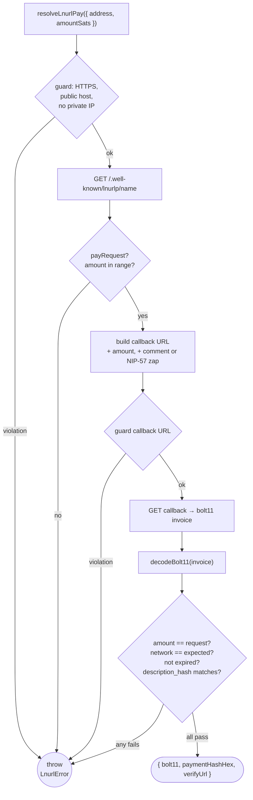
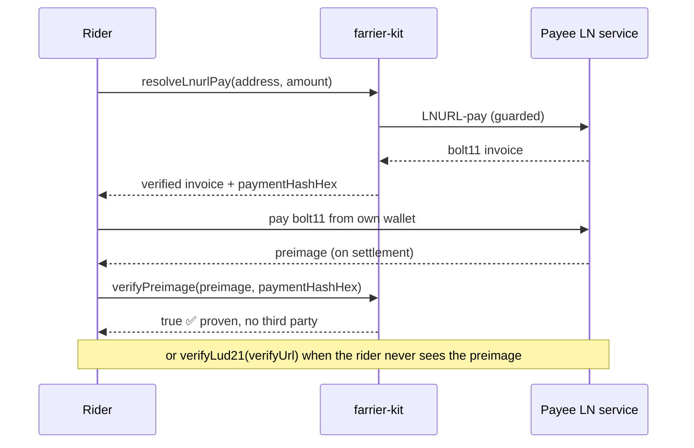

# farrier-kit

[](https://github.com/forgesworn/farrier-kit/actions/workflows/ci.yml)
[](https://primal.net/p/npub1mgvlrnf5hm9yf0n5mf9nqmvarhvxkc6remu5ec3vf8r0txqkuk7su0e7q2)
[](./LICENSE)

Lightning payment **primitives** that work anywhere. A farrier shoes working
animals for the road; this kit shoes your payment paths.

farrier-kit is the small, verifiable core you reach for when an app needs to
**read and verify** Lightning payment data without running a node: decode a
BOLT-11 invoice, resolve a Lightning Address to an invoice for an exact amount,
and prove a payment settled. It is browser- and Node-safe from one codebase,
depends only on [`@noble/hashes`](https://github.com/paulmillr/noble-hashes), and
ships [language-neutral conformance vectors](./CONFORMANCE.md) so a Kotlin or
Swift port can verify payments identically.

It is **not** a wallet and **not** a node client. It holds no keys and moves no
money — it decodes, resolves, and verifies.

## Modules

| Import | What it does |
|--------|--------------|
| [`farrier-kit/bolt11`](#bolt11) | Decode a BOLT-11 invoice — payment hash, amount, description, expiry, network. Checksum-verified; no node library pulled in to read two fields. |
| [`farrier-kit/preimage`](#preimage) | `payment_hash = SHA-256(preimage)`: generate, hash, verify (constant-time). |
| [`farrier-kit/lnurl`](#lnurl) | Lightning Address → invoice (LUD-06/16), LUD-21 verify, capability probing — SSRF-guarded, and the resolved invoice is checked for amount, network, expiry, and description-hash. |
| [`farrier-kit/http`](#http) | `fetchJson` with a hard timeout, a response-size cap, and a safe redirect default. |

## Install

```bash
npm install farrier-kit
```

Node ≥18, dual ESM + CJS, TypeScript types included. Zero configuration, no
build step in the consumer.

## Design rules

1. **Browser and Node from one codebase.** No `node:` imports anywhere in the
   library — CI greps for them and bundles the output with
   `esbuild --platform=browser` to prove it. `@noble/hashes` is the only runtime
   dependency.
2. **Dual ESM + CJS.** `import` or `require`, any bundler.
3. **Injectable I/O.** `fetch` is a parameter, not an ambient assumption.
4. **Explicit amounts.** Millisatoshis are `bigint`. `amountSats` is set only
   when the amount divides exactly; flooring is a separate, named operation
   (`msatsToSatsFloor`) so a sub-satoshi remainder can never vanish silently.
5. **Verified against independents.** Every invoice fixture is cross-validated
   against `light-bolt11-decoder` and the BOLT-11 spec vector; preimage hashing
   against a second SHA-256; and the whole verifiable surface is pinned by
   [conformance vectors](./CONFORMANCE.md).
6. **Safe by default.** The LNURL path refuses non-HTTPS, credentials, private
   IPs, redirects, and oversized bodies without being asked.

## How resolution and verification fit together

`resolveLnurlPay` is a pipeline: every network hop is SSRF-guarded, and the
invoice the payee returns is decoded and checked against what you asked for
before you ever see it.



The non-custodial settlement lifecycle — the operator advertises and verifies,
the rider pays the payee directly:



## bolt11

```js
import { decodeBolt11, verifyInvoiceCommitment } from 'farrier-kit/bolt11'

const inv = decodeBolt11('lnbc2500u1p...')
inv.paymentHashHex // '0001…0102'
inv.amountMsats    // 250000000n  (bigint; null when amountless)
inv.amountSats     // 250000      (null when not a whole satoshi)
inv.network        // 'bc' | 'tb' | 'tbs' | 'bcrt' | 'sb'
inv.expirySeconds  // 60 (spec default 3600 when absent)

// Pre-payment check. The payment_hash ALONE is not enough — the payee picks the
// preimage, so they can mint a second invoice with the same hash and any amount.
// Pass expectedMsats (and rely on the default mainnet network) when money moves.
const check = verifyInvoiceCommitment({
  bolt11,
  paymentHash: expectedHash,
  expectedMsats: 250000000n,
})
if (!check.ok) throw new Error(check.reason)
```

`decodeBolt11` throws a `Bolt11Error` (with a machine-readable `code`) on
anything that is not a checksum-valid invoice carrying a payment hash. When "not
an invoice" is expected input, use `tryDecodeBolt11` (returns `null`) or the
single-field helpers `bolt11PaymentHash` / `bolt11AmountMsats`.

## preimage

```js
import { generatePreimage, computePaymentHash, verifyPreimage } from 'farrier-kit/preimage'

const preimage = generatePreimage()
const paymentHash = computePaymentHash(preimage)
// … invoice settles, the counterparty reveals the preimage …
verifyPreimage(revealed, paymentHash) // constant-time true / false
```

The signatures match [escrow-kit](https://github.com/forgesworn/escrow-kit) so
that library adopts these by re-export.

## lnurl

```js
import { resolveLnurlPay, verifyLud21 } from 'farrier-kit/lnurl'

// Lightning Address → bolt11 for an exact amount. The returned invoice has been
// decoded and checked: amount equals the request, mainnet by default, not
// expired, and (for zaps) its description_hash commits to the zap request.
const paid = await resolveLnurlPay({ address: 'alice@wallet.example.com', amountSats: 21000 })
paid.bolt11         // hand to any wallet
paid.paymentHashHex // verify the revealed preimage against this
paid.verifyUrl      // LUD-21, origin-bound to the callback, when offered

// LUD-21 settlement check. verified === true only when a returned preimage
// cryptographically matches; settled alone is the service's word, not proof.
const status = await verifyLud21({ verifyUrl: paid.verifyUrl, paymentHashHex: paid.paymentHashHex })
```

## http

```js
import { fetchJson } from 'farrier-kit/http'

const body = await fetchJson('https://example.com/.well-known/lnurlp/alice', {
  timeoutMs: 5000,   // default 8000
  maxBytes: 262144,  // default 10 MB; the body is metered and aborted mid-flight
  fetchImpl: myFetch,// optional; defaults to globalThis.fetch
})
```

`fetchJson` defaults `redirect` to `'manual'` — a safe default for a payments
util so a public host cannot 3xx-bounce a request inward. Pass
`redirect: 'follow'` to opt in.

## SSRF: what the guard does and does not do

`resolveLnurlPay` fetches from payee-controlled domains, so it is an SSRF
surface. The built-in guard rejects an HTTPS violation, credentials in the URL,
`localhost`/`.local`/`.internal` hosts (trailing dots included), and any **IP
literal** in a private or reserved range — IPv4, and IPv6 in every form the URL
parser normalises to (mapped `::ffff:*`, NAT64, 6to4, Teredo, link/site-local,
ULA, multicast).

What it **cannot** do in the core: stop a *hostname* that resolves to a private
address (an attacker A-record at `10.0.0.5`, or a DNS-rebinding TOCTOU).
Browsers cannot resolve DNS, so a safe default is impossible without a Node
dependency. **On a server that resolves untrusted addresses, pass `urlGuard`**:

```js
import { lookup } from 'node:dns/promises'
import { isPrivateIpLiteral, resolveLnurlPay } from 'farrier-kit/lnurl'

const pinToPublic = async (url) => {
  const { address } = await lookup(url.hostname)
  if (isPrivateIpLiteral(address)) throw new Error(`blocked: ${url.hostname} -> ${address}`)
}

await resolveLnurlPay({ address, amountSats, urlGuard: pinToPublic })
```

`urlGuard` runs after the built-in checks, on every fetched URL.

## Conformance & porting (Kotlin, Swift, Rust)

The pure, deterministic surface is pinned by language-neutral vectors in
[`vectors/`](./vectors), so a native port can be validated byte-for-byte against
the same contract the TypeScript reference passes — see
[CONFORMANCE.md](./CONFORMANCE.md). This is how the Android / GrapheneOS clients
on the roadmap verify payments identically to the browser build. The vectors
ship in the npm package, and CI regenerates them from independent oracles and
fails on any drift.

## Security

farrier-kit had a full independent security audit (three reviewers plus a Codex
cross-check) before its first release: the SSRF guard, invoice amount/network
gating, and response caps were hardened as a result, each with a regression
test. Cryptography is [`@noble/hashes`](https://github.com/paulmillr/noble-hashes),
not hand-rolled. It has not had a paid third-party audit; treat it accordingly
for high-value custody. Report issues via
[GitHub](https://github.com/forgesworn/farrier-kit/issues).

## Comparison

Most Lightning JS libraries either only **decode** an invoice, or are wallet /
**payment** toolkits that resolve a Lightning Address and hand you an invoice to
pay. farrier-kit is deliberately neither — it is the read-and-**verify** layer
that sits *before* payment.

| Library | bolt11 decode | LNURL resolve | invoice gating¹ | **SSRF guard** | preimage / LUD-21 verify | sends / zaps | browser + Node | core deps |
|---|:--:|:--:|:--:|:--:|:--:|:--:|:--:|---|
| **farrier-kit** | ✓ | ✓ | **✓ all four** | **✓** | ✓ | ✗ | ✓ | @noble only |
| [light-bolt11-decoder](https://github.com/fiatjaf/light-bolt11-decoder) | ✓ | ✗ | ✗ | – | ✗ | ✗ | ✓ | `@scure/base` |
| [bolt11](https://github.com/bitcoinjs/bolt11) (bitcoinjs) | ✓ +encode/sign | ✗ | ✗ | – | ✗ | ✗ | ~ native secp | heavy |
| [@getalby/lightning-tools](https://github.com/getAlby/js-lightning-tools) | ✓ | ✓ | ✗ | ✗ | ✓ | ✓ zaps/NWC/L402 | ✓ | zero-install (bundled) |
| [lnurl-pay](https://github.com/dolcalmi/lnurl-pay) | ✓ | ✓ | ~ amount + desc-hash | ✗ (accepts `localhost`) | ✓ | ✗ | ✓ | browserify tree |

¹ _invoice gating = checking the **resolved** invoice against what you asked for: amount, network, expiry, and description-hash._

**What's actually unique.** To our knowledge farrier-kit is the only JS/TS
library that **guards LNURL / Lightning-Address resolution against SSRF** —
Alby fetches the callback unchecked, and lnurl-pay's URL check explicitly accepts
`localhost`. It is also the only one that gates the resolved invoice on **all
four** of amount, network, expiry and description-hash: `lnurl-pay` already
verifies amount and description-hash (good prior art), but not network or expiry;
Alby verifies none of them. The differentiator is the *combination* —
SSRF-guarded resolution **and** the full four-way gate **and** preimage verify,
in the browser and Node from an @noble-only core.

**Where the others win, and you should use them.** If you need to **send**
payments, zap, or reach a wallet, [@getalby/lightning-tools](https://github.com/getAlby/js-lightning-tools)
is the one to beat — actively maintained, zero install-deps (it bundles its
tree), and it does WebLN, NWC, NIP-57 zaps, boostagram and L402, none of which
farrier-kit will ever do. If you only need to **decode**,
[light-bolt11-decoder](https://github.com/fiatjaf/light-bolt11-decoder) is
smaller and more battle-tested (Alby itself bundles it). If you need to
**create/sign** invoices, use [bolt11](https://github.com/bitcoinjs/bolt11).
farrier-kit's job is the narrow, security-critical slice those leave open:
safely verifying what someone handed you.

## Roadmap

| Module | Status |
|--------|--------|
| `/bolt11`, `/preimage`, `/lnurl`, `/http` | shipped |
| Conformance vectors + porting guide | shipped |
| `/nwc` — NIP-47 client (both transport patterns) + wallet-service harness | planned |
| `/nostr-crypto` — NIP-04 / NIP-44 v2 on @noble, official-vector CI | planned |
| `/fiat` — BTC price oracle, ISO-4217 minor units, formatting | planned |
| `/handles` — Lightning Address / MSISDN validation + PII classification | planned |

## Support

For issues and feature requests, see [GitHub Issues](https://github.com/forgesworn/farrier-kit/issues).

If you find farrier-kit useful, consider sending a tip:

- **Lightning:** `profusemeat89@walletofsatoshi.com`
- **Nostr zaps:** `npub1mgvlrnf5hm9yf0n5mf9nqmvarhvxkc6remu5ec3vf8r0txqkuk7su0e7q2`

## Licence

MIT
